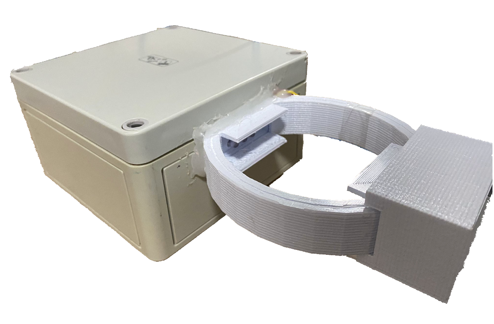
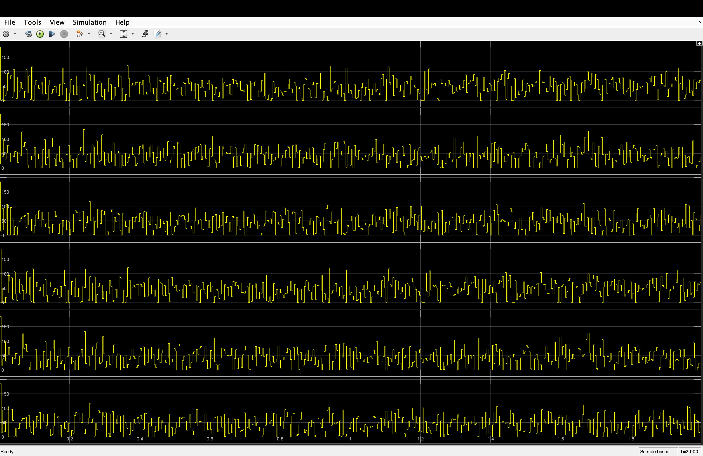

# B.Rain Digital Twin
This is a work done by Michele Simonetti for his master degree thesis in Computer Engineering at University of Naples Federico II. This work has been promoted by the Technosky team.

The purpose of this work is to design and develop a digital twin system for the B.Rain device, in order to generate synthetic data which will be adopted to train Machine Learning models for rain intensity prediction.

This repository contains both the Simulink pjoject, composed of the .slx model file, the .m files containing the utility functions and the .mlx Live Script file which can be used to launch the Simulink model, and the Python script for model training and inference.

## Digital Twin and Rain Generator (Simulink System)
The Simulink system enables to start a simulation of interaction between the B.Rain digital twin and a simulated rain condition. It is suggested to run the Simulink model from the Live Script called BRainDigitalTwin.mlx, but the simulation can be run directly from the Simulink model file called DigitalTwinMachine.slx as well.

The system is composed of four subsystems:
- The rain generator
- The rain matrix visualizer
- The light values calculator
- The physical photodiodes system

In order to simulate different rain conditions, there are some parameters which can be changed. In particular, both in the Live Script file and in the Simulink model there are some widgets which enable to configure the following parameters:
- StopTime: End of execution time in seconds
- RateDecr: Rain drops velocity
- NumGocce: Number of rain drops generated in each instant
- TInterval

Moreover, there are some more parameters which indicate the physical position of the photodiodes inside the B.Rain device, therefore they can be changed in case the physical device will be built differently in the near future. These are the parameters:
- Center0: Center of left photodiodes
- Center1: Center of central photodiodes
- Center2: Center of right photodiodes
- HalfHeight: Half-dimension of photodiodes

Once launched the execution, two screens will appear: the VideoViewer and the Output Scope. The first will show the evolution of rain matrix during the execution, while the second will show the plots of the 6 photodiodes values along time.

At the end of the execution, a file called synth_ds.csv will be generated. This file contains all the values from the 6 photodiodes in each instant.

## Machine Learning Workflow (Python System)
Once obtained the .csv file containing the values of photodiodes for each instant, there is the Python script called FinalScriptNN.py which should be launched in order to start the training process of the chosen models.

In particular, there are three available models:
- Support Vector Machine
- Random Forest
- Multi-Layer Perceptron
